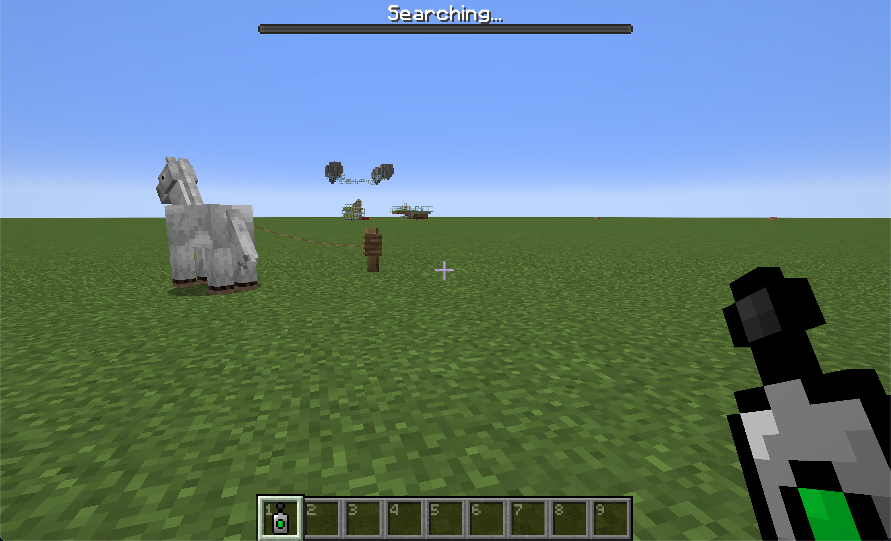

# Gallop Gauge

This is a datapack for Minecraft 1.21.1 that adds a bossbar to the player's screen that shows the horse's speed, jump height, and health.

## Recipe

## How to use

- Craft the detector item with a horse.
- Hold the detector item in your hand.
  - If no horse is detected, the bossbar will say "Searching...".
    - 
  - If you move within 5 blocks of a horse, the nearest horse to the player will begin to glow and the bossbar will show the following attributes (from left to right):
    - Horse health
    - Horse speed
    - Horse Jump height
    - 

## Installation

Dowload the latest release from the [releases page](https://github.com/joshatbond/Gallop-Gauge/releases) and place the:

- `datapack` zip file in your minecraft world `datapacks` folder.
- `resourcepack` zip file in your minecraft world `resourcepacks` folder.
